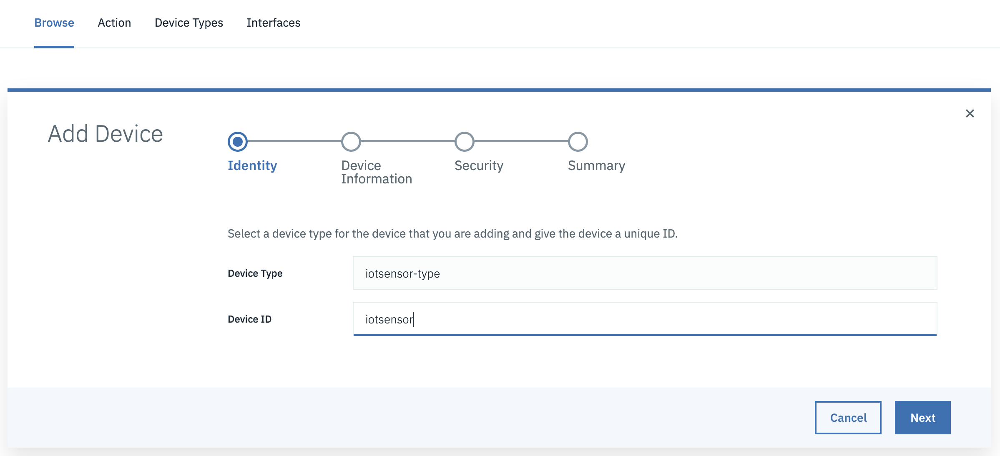
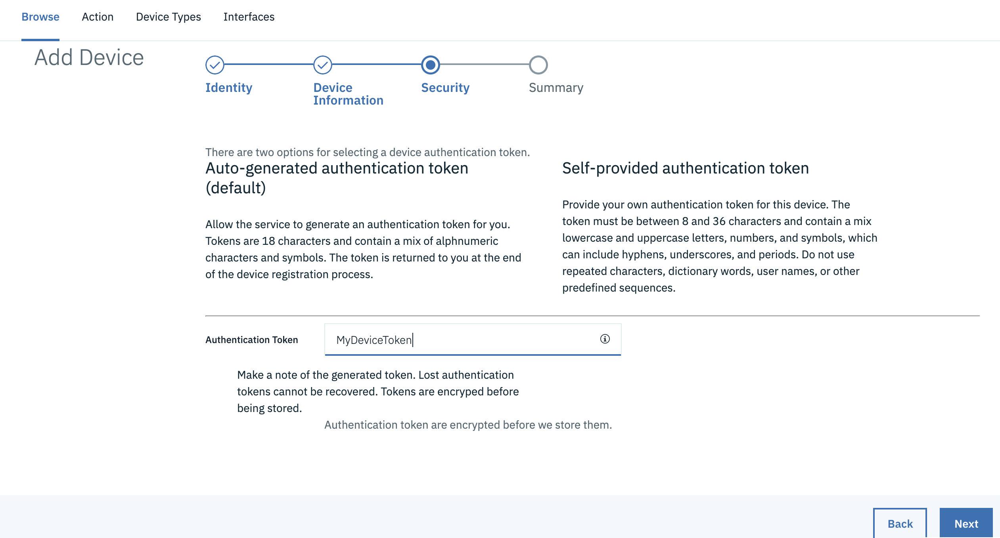
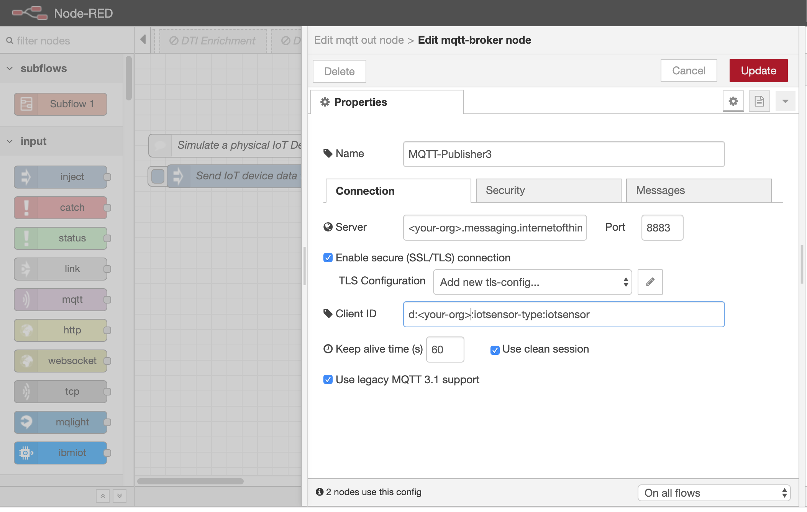
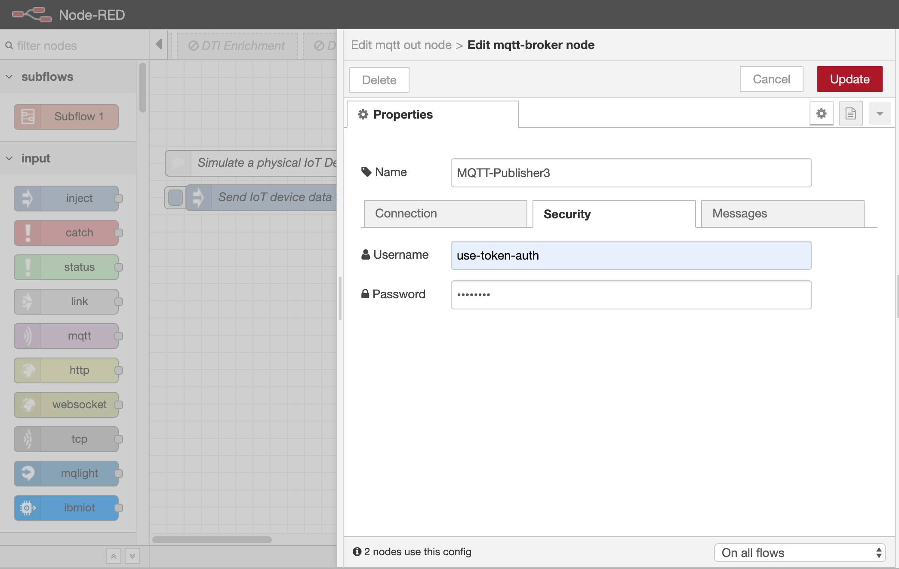
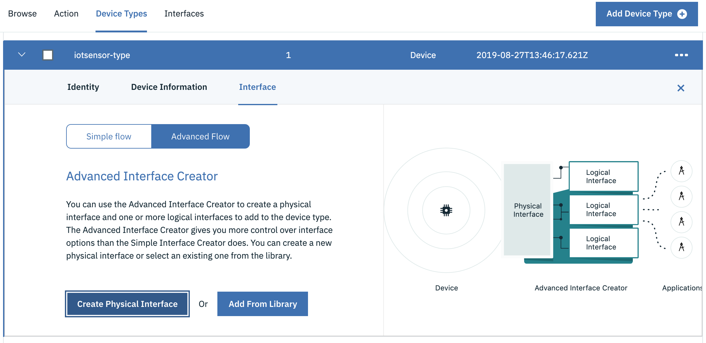
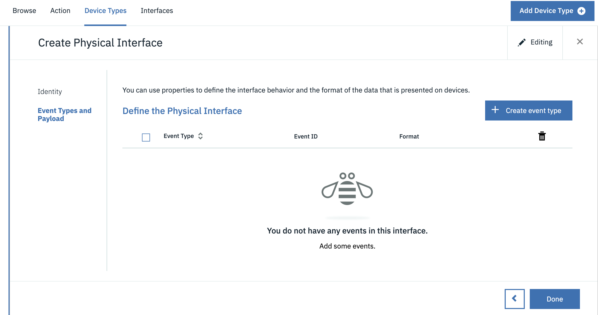
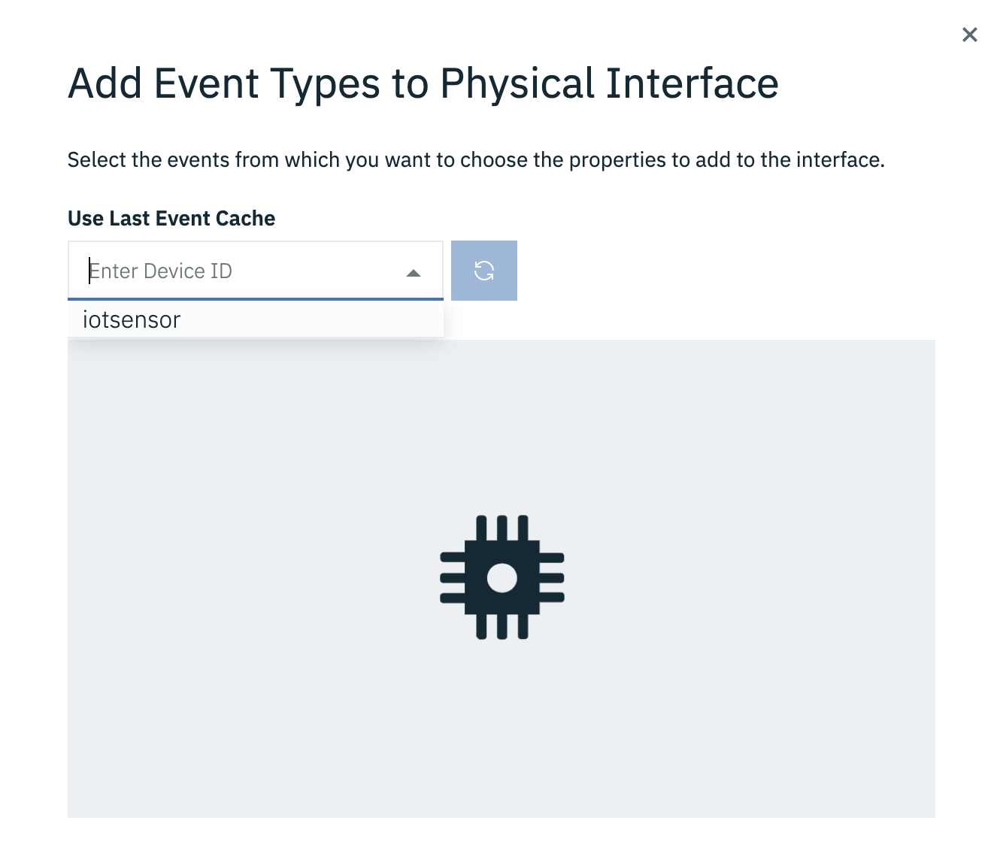
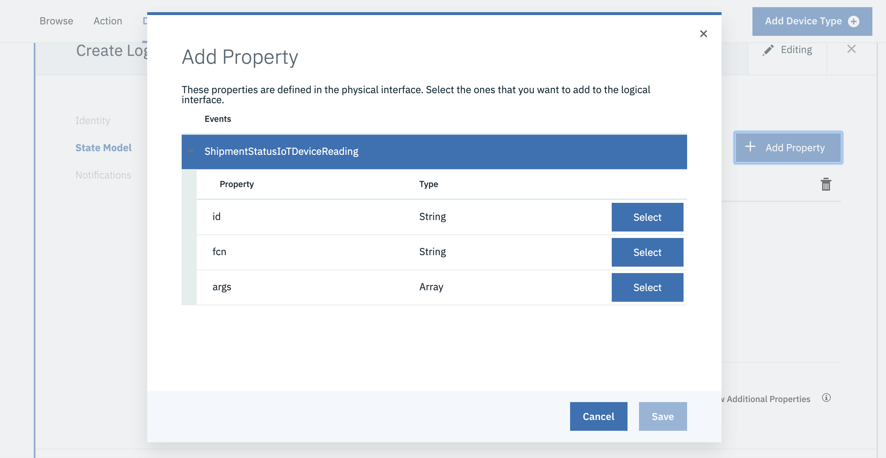
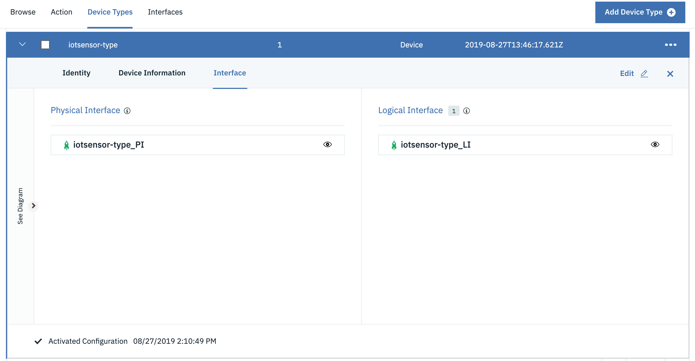

# **Use Watson IoT Platform and Cloud Functions to Send IoT Data to Your Blockchain**

In this tutorial, we'll show you how to configure a rule in Watson IoT Platform to call a blockchain IBM Cloud Function, allowing you to send your IoT device data to your blockchain.  If you first follow the "Use Cloud Functions to Send Your Data to Your Blockchain" tutorial, you will have a blockchain, smart contract and cloud functions to use with this tutorial.  

**Learning objectives**

This tutorial guides you through the steps to configure a rule, trigger and action in Watson IoT Platform Connection Service to call a blockchain cloud function with data from a simulated IoT device.  

When you finish this tutorial, you will have: 

-   A rule, trigger and action that send IoT data to your blockchain 

-   A Node-RED test environment to send IoT events to your Watson IoT Platform Connection Service 

**Prerequisites**

For this tutorial, you will need a Watson IoT Platform account and Node-RED to send simulated IoT data to Watson IoT Platform.    

Before you start, you need to deploy the following IBM Cloud products to complete this tutorial: 

-   [IBM Watson IoT Platform](https://cloud.ibm.com/catalog/services/internet-of-things-platform)  
Note: You may opt for a free 30-day IBM Watson IoT Platform Lite instance which may be deleted after 30 days of inactivity.

-   [Node-RED](https://cloud.ibm.com/catalog/starters/node-red-starter)   

You will also need the blockchain, smart contract, cloud functions and Postman from the [Use Cloud Functions to Send Your Data to Your Blockchain](http://ibm.developer.com) tutorial.  

**Estimated time** 

After the prerequisites are installed, it should take you about 30 minutes to complete this tutorial. 

**Steps**

1. **Clone the repository**  
    `git clone https://github.com/IBM/ibm-cloud-functions-serverless-blockchain.git`  
    Note: All directories mentioned in this tutorial are relative to the `ibm-cloud-functions-serverless-blockchain` base directory of this project.
    
2. **Create a device in IBM Watson IoT Platform**  
    a. From your IBM Cloud account, launch your IBM Watson IoT Platform instance.  
    b. Click on Devices in the menu, then click `Add Device`.  
    c. Use `iotsensor-type` for the device type and click `Create device type iotsensor-type`  
    d. Use `iotsensor` for the device and click `Next`.  
    
    e. You do not need to add device metadata for this tutorial, so click `Next` again.  
    f. Supply a device token you will remember, such as `MyDeviceToken` and click `Next`. Alternatively, you may click `Next` without supplying a token to generate a token instead.  
    
    g. Click `Finish` and be sure to note your device token. You will need this token in a future step.

3.  **Load and configure the supplied Node-RED Flow**  
    a. From your IBM Cloud account, launch your Node-RED flow editor.  
    b. Go to Import -> Clipboard and click `select a file to import`  
    c. Select the file `tutorials/cf-send-iot-to-blockchain/node-red-iot-device-sim.json` from the repository you cloned.  
    d. Open the 	`Publish to IoT` node and edit the `Server` information.  Replace \<your-org\> with your actual Watson IoT Platform organization in both the `Server` name and `Client ID` fields.  
    
    e. Click on `Security` and supply `use-token-auth` for the `Username` field and your device token from a previous step in the `Password` field.  
    
    f. Click `Update`, then click `Done`, then click `Deploy` to activate your changes. You should see a green connected status for your `Publish to IoT` node.  
    g. Click `Send IoT device data to IoTP`.  This will populate the last event cache in Watson IoT Platform.
    
4.  **Create an interface for your device type in IBM Watson IoT Platform**  
    a. In your IBM Watson IoT Platform UI, click on Devices in the menu, then click `Device Types`, then click on the device type `iotsensor-type`.  
    b. Click on `Interface`, click on `Advanced Flow`, then click on  `Create Physical Interface`.  
    
    c. Click `Next` and then click `Add some events`.  
    
    d. Click `Use Last Event Cache` then click the dropdown and select `iotsensor`.  
    
    e. Select `ShipmentStatusIoTDeviceReading` then click `Add`. If you don't see `Add` try maximizing your window.  
    f. Click `Done`.  
    g. Click `Create Logical Interface` and click `Next`.  
    h. Click `Add Property`, then `Select` for one of the attributes and `Save`.  Repeat for each of the remaining attributes.  
    
    i. Click `Next` then click on `No event notifications` and change to `All events`, then click `Apply`.  
    j. Click `Done`, click `Activate`, click `Activate` again, then click `Done`.  
    
    
5.  **Install and configure the provided Postman collection**  

    ***Import the Postman collection***  
    In the Postman UI, click the "Import" button to import the file:  
     `tutorials/cf-send-iot-to-blockchain/IoTPAPICalls.postman_collection.json`  
     
     ***Create a Postman environment***  
    a. In the Postman UI, click on the environment settings gear to "Manage Environments", then click the "Add" button to create a new environment.  
    b. Give your environment a name.  
    c. Create a variable "api-key" and give it the value of your IoTP REST API key.  
    d. Create a variable "api-token" and give it the value of your IoTP REST API token.  
    e. Create a variable "org" and give it the value of your IoTP organization.  
    e. Click "Persist All" and click "Add" to create your environment.  
    g. Select your new environment from the drop-down list to use the API key and org values you just defined.  All the API calls in this collection will use these values automatically, in the URLs and for basic authorization.  

6.  **Create a rule in IBM Watson IoT Platform**  
    a. In the Postman UI, click on the REST call `1. GET all active logical interfaces` and click `Send`.  
    b. In the results returned from the REST call, find the result with the name "iotsensor-type_LI" and note the value of the "id" field.  
    c. In your Postman environment, create the variable "logical-if" and give it the value of the "id" field (without quotes) from the previous step.  This is the id of the logical interface that you will attach your rule to.  
    d. Click on the REST call `2. POST IoTP Rule` and click `Send`.  You should see a result similar to:  
    
    ```
    {  
      "version": "draft",  
      "created": "2019-08-28T15:03:22Z",  
      "createdBy": "a-d807by-wnjjrw7jul",  
      "updated": "2019-08-28T15:03:22Z",  
      "updatedBy": "a-d807by-wnjjrw7jul",  
      "name": "FireOnEveryEvent",  
      "description": "Rule to fire on every event",  
      "id": "5d6697baabb31e001eae39d0",  
      "logicalInterfaceId": "5d658024e24d7e00229124a2",  
      "condition": "$state.id = $state.id",  
      "refs": {  
        "logicalInterface": "/api/v0002/draft/logicalinterfaces/5d658024e24d7e00229124a2",
        "self": "/api/v0002/draft/logicalinterfaces/5d658024e24d7e00229124a2/rules/5d6697baabb31e001eae39d0"
      },  
      "notificationStrategy": {  
        "when": "every-time"  
      }  
    }
```  
   e. In your Postman environment, create the variable "rule-id" and give it the value of the "id" (without quotes) from the `2. POST IoTP Rule` REST call.  
   f. Click on the REST call `3. PATCH Activate rule` and click `Send`. You should see:  
   
   ```  
   {  
     "message": "CUDIM0300I: State update configuration for Device Type 'iotsensor-type' has been successfully submitted for activation.",  
     "details": {  
       "id": "CUDIM0300I",  
       "properties": [  
         "Device Type",  
         "iotsensor-type"  
       ]  
     },  
     "failures": []  
   }  
   
   ```  
   
7.  **Create an action in IBM Watson IoT Platform**  
    a. In your Postman environment, create the variable "action-targetUrl" (without quotes) and give it the value of the URL for the send-to-blockchain action from the "Use Cloud Functions to Send Your Data to Your Blockchain" tutorial.  
    b. In your Postman environment, create the variable "action-username" and give it the value of the "user" portion of your Cloud Functions API key  (without quotes) from the "Use Cloud Functions to Send Your Data to Your Blockchain" tutorial.  
    Reminder: The Cloud Functions API key consists of user:password. Supply the portion before the ':' for the "action-username" value.  
    c. In your Postman environment, create the variable "action-password" and give it the value of the "password" portion of your Cloud Functions API key (without quotes) from the "Use Cloud Functions to Send Your Data to Your Blockchain" tutorial.  
    Reminder: The Cloud Functions API key consists of user:password. Supply the portion after the ':' for the "action-password" value.  
    d. In the Postman UI, click on the REST call `4. POST IoTP action` and click `Send`. You should see:  
   
   ```  
   {
      "id": "5d66bce2293575001e3d61a1",
      "name": "SendToBlockchain",
      "description": "Send a transaction to a blockchain",
      "enabled": true,
      "adminDisabled": false,
      "createdBy": "a-d807by-wnjjrw7jul",
      "created": "2019-08-28T17:41:54Z",
      "updatedBy": "a-d807by-wnjjrw7jul",
      "updated": "2019-08-28T17:41:54Z",
      "type": "webhook",
      "refs": {
        "triggers": "/api/v0002/actions/5d66bce2293575001e3d61a1/triggers"
      },
      "configuration": {
        "targetUrl": "https://us-south.functions.cloud.ibm.com/api/v1/namespaces/<your-org>/actions/send-to-blockchain",
        "method": "POST",
        "contentType": "application/json",
        "username": "********************",
        "password": "********************",
        "headers": [],
        "body": "{{{ruleTriggerJSON}}}"
      }
   }  
   
   ```  
   e. In your Postman environment, create the variable "action-id" and give it the value of the "id" (without quotes) from the `4.POST IoTP action` REST call.
    
8.  **Create a trigger in IBM Watson IoT Platform**  
    a. In the Postman UI, click on the REST call `5. POST IoTP Trigger` and click `Send`. You should see:  
   
   ```  
   {
      "id": "5d66c1d7dacfe1001f89cb67",
      "name": "SendToBlockchainTrigger",
      "description": "Trigger that invokes the SendToBlockchain action when rule FireOnEveryEvent fires",
      "enabled": true,
      "adminDisabled": false,
      "createdBy": "a-d807by-wnjjrw7jul",
      "created": "2019-08-28T18:03:03Z",
      "updatedBy": "a-d807by-wnjjrw7jul",
      "updated": "2019-08-28T18:03:03Z",
      "type": "rule",
      "variableMappings": {
        "ruleTriggerJSON": "$event.state"
      },
      "configuration": {
        "logicalInterfaceId": "5d658024e24d7e00229124a2",
        "ruleId": "5d6697baabb31e001eae39d0",
        "type": "device",
        "typeId": "iotsensor-type",
        "instanceId": "iotsensor"
      }
   }  
   
   ```     

9.  **Send IoT data to IBM Watson IoT Platform**  
    a. From your IBM Cloud account, launch your Node-RED flow editor.  
    b. Click `Send IoT device data to IoTP`.  This will send a transaction to Watson IoT Platform, which is now configured to send every event to your blockchain.  

10. **Look for a new block in your blockchain**  
    a. In your IBM Blockchain Platform UI, from the "Use Cloud Functions to Send Your Data to Your Blockchain" tutorial, click on "Channels".  
    b. Click on the channel you created when setting up your blockchain network.  
    c. Scroll down to "Block History" and click on the most recent block.  
    d. In the resulting transaction list for that block, click on the most recent transaction to see the transaction you just sent. 

**Summary**  

Congratulations! You should now be able to send your IoT data to Watson IoT Platform, which then sends your IoT data as a transaction to your blockchain via a cloud function.  
